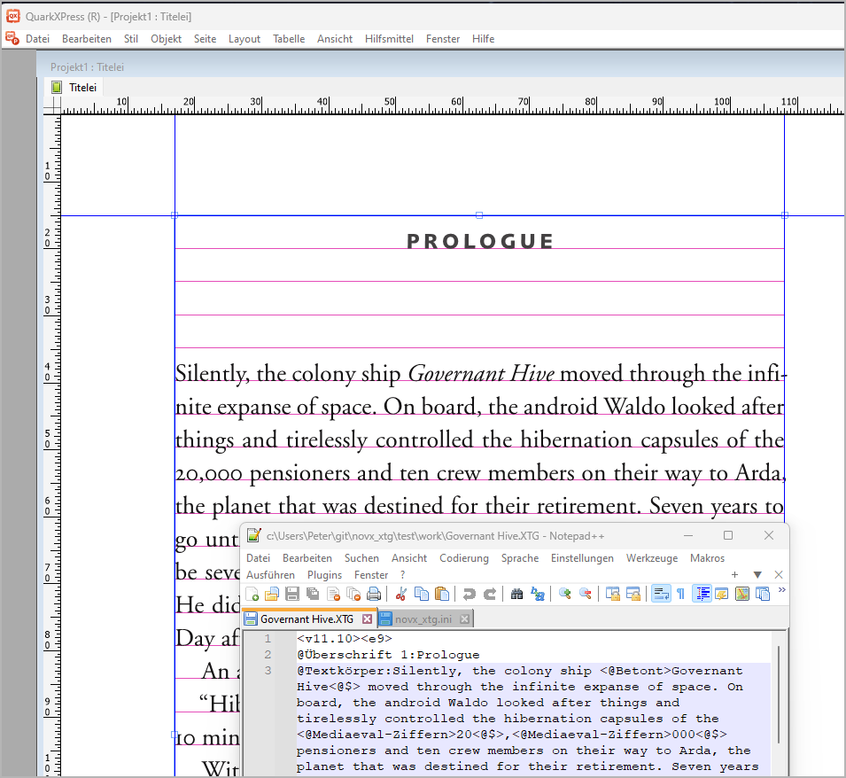

#  novx_xtg

The novx_xtg Python script exports [novelibre](https://github.com/peter88213/novelibre/) projects as a whole in the *XPress Tags* format for the Quark XPress DTP software. It generates an XTG file ready for import into a QX book project. This is done based on template files for chapters and sections, so you can be quite flexible with the program output. In addition, the exporter script can take some routine work off your hands, for example, formatting figures and acronyms in a special way, if desired. Formatting codes and paragraph/character style tags are read from a configuration file.
Optionally, one XTG file per chapter can be generated.

## Requirements

- Windows.
- [Python](https://www.python.org/) version 3.6+.

## Download and install

[Download the latest release (version 2.5.2)](https://raw.githubusercontent.com/peter88213/novx_xtg/main/dist/novx_xtg_v2.5.2.pyzw)

- Extract the "novx_xtg_v2.5.2" folder from the downloaded zipfile "novx_xtg_v2.5.2.pyzw".
- Move into this new folder and launch **setup.pyw**. This installs the script for the local user.
- Create a shortcut on the desktop when asked.
- Open "README.md" for further instructions.

---

[Changelog](docs/changelog.md)

## Usage

See the [instructions for use](docs/usage.md)

## Credits

- The logo and the file icons are made using the free *Pusab* font by Ryoichi Tsunekawa, [Flat-it](http://flat-it.com/).
- User *Hunter_71* presented the number to English conversion algorithm on [stack overflow](https://stackoverflow.com/a/51849443).
- User *Aristide* presented the integer to roman numeral conversion on [stack overflow](https://stackoverflow.com/a/47713392).

## License

This is Open Source software, and *novx_xtg* is licensed under GPLv3. See the
[GNU General Public License website](https://www.gnu.org/licenses/gpl-3.0.en.html) for more
details, or consult the [LICENSE](https://github.com/peter88213/novx_xtg/blob/main/LICENSE) file.
